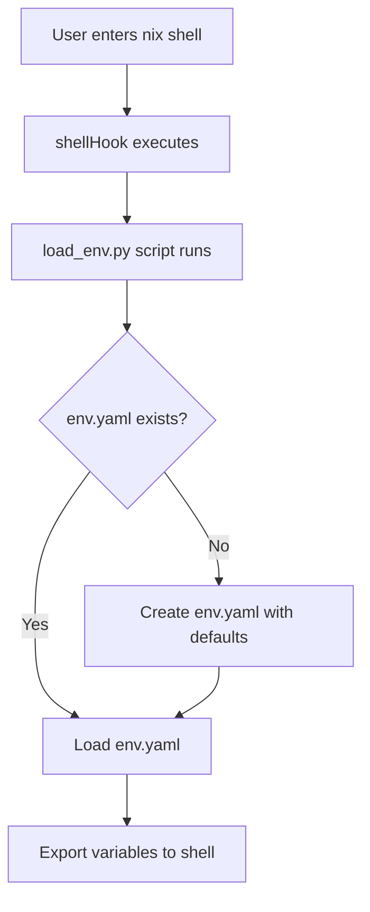

# Local Environment Store with shell.nix

## User Intent

The user wants to set up a local environment store that:
1. Loads environment variables automatically when entering the nix shell
2. Stores environment variables in YAML format
3. Creates a default environment file if none exists

## Implementation Design

### Architecture

### Components

1. **env.yaml** - YAML file storing environment variables at project root
2. **scripts/load_env.py** - Python script to manage environment loading
3. **shell.nix** - Updated to integrate the loading mechanism

### Default Environment Variables

The following default values will be created:

- `DEBUG`: false
- `SECRET_KEY`: default-dev-key-change-in-production
- `DATABASE_URL`: sqlite:///db.sqlite3
- `LOG_LEVEL`: INFO
- `PYTHON_ENV`: development

### Security Considerations

- env.yaml is added to .gitignore to prevent committing sensitive values
- Default SECRET_KEY is clearly marked for development only

## Usage

When entering the nix shell, environment variables are automatically loaded.

To modify environment variables, edit `env.yaml` and re-enter the shell.

## Files Created/Modified

- `env.yaml` - Environment variable store (created if missing)
- `scripts/load_env.py` - Environment loading script
- `shell.nix` - Updated with shellHook integration
- `.gitignore` - Updated to exclude env.yaml

## Implementation Status

Completed. The environment store system is fully functional:
- Environment variables are automatically loaded when entering nix shell
- Default env.yaml is created with sensible development values
- Variables are stored in YAML format as requested
- env.yaml is excluded from git to protect sensitive values
